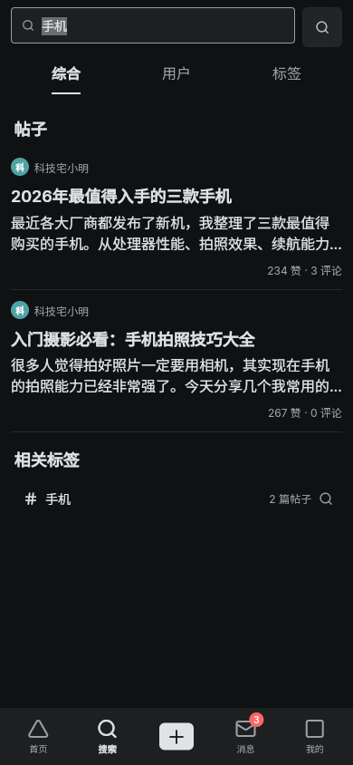
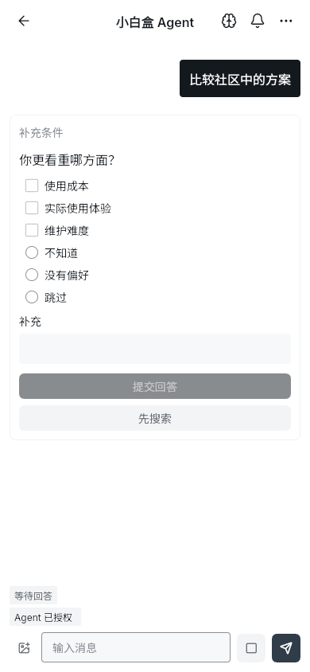
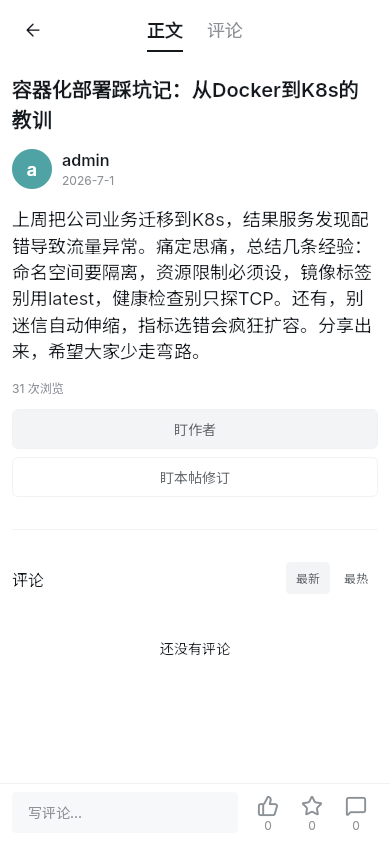

# 小白盒 Flutter 客户端

小白盒内容社区的 Flutter 前端，覆盖内容浏览、搜索、创作、互动、公开资料与一对一私信。
小白盒 Agent 位于消息页的固定虚拟线程中，辅助用户澄清需求、检索社区资料、查看来源、管理个人
记忆与 Watch 条件追踪；社区操作不以使用 Agent 为前提。

本仓库 `little-white-box-front` 的 Flutter 应用位于仓库根目录。既可独立运行仓库内 Mock API，
也可连接真实 Gateway；完整联调由 [根编排仓](https://github.com/3219378872/little-white-box)统一管理。

[界面预览](#界面预览) · [技术与目录](#技术与目录) · [快速开始](#快速开始) · [真实 API 联调](#真实-api-联调) · [SDK 工作流](#sdk-工作流) · [检查与文档](#检查与文档)

## 界面预览

以下复用 2026-09-06 上一轮浏览器截图。Mock 使用演示数据，真实联调图来自本地测试栈；均不是生产
数据或当前版本的完整验收结论。[截图来源与说明](docs/assets/screenshots/README.md)。

### 桌面内容流 · Mock


### 移动端

依次为：暗色搜索结果（Mock）、Agent 澄清问答（Mock）、帖子详情（真实联调）。窄屏下图片依次换行。

<p>
  
  
  
</p>

## 定位与界面能力

| 场景 | 客户端职责 |
| --- | --- |
| 浏览与发现 | Feed、搜索、帖子详情和公开资料，保留加载、空态与错误恢复路径 |
| 创作与互动 | 登录后的帖子编辑、媒体、评论、点赞、收藏与关注 |
| 消息 | 普通私信与固定 Agent 线程；Agent 授权、任务进度、澄清问答和来源查看 |
| 个人上下文 | 个人资料、自然语言记忆及 Watch 条件追踪入口 |
| 展示 | 亮色/暗色主题、移动与桌面布局、适配触控和桌面交互 |

以上介绍界面与模块范围，不代表全部规格或平台均已验收。Mock、真实后端、浏览器和设备的证据边界
分别记录在知识库中，不能相互替代。

## 技术与目录

应用使用 Flutter、Riverpod、GoRouter 和 Forui。`MaterialApp.router` 承担应用壳，Forui 的主题、
组件与 overlay 能力由全局装配注入。依赖以 [pubspec.yaml](pubspec.yaml) 和
[pubspec.lock](pubspec.lock) 为准；共享展示约定见
[展示设计](docs/knowledge/design/DES-presentation-client.md)。

```text
.
|-- lib/
|   |-- core/             # API 适配、路由、主题等共享能力
|   |-- features/         # 按业务领域组织的页面、状态与 repository
|   |-- mock/             # 开发用 Mock API
|   |-- sdk/              # 应用消费的 SDK 副本
|   |-- main.dart         # 真实 API 入口
|   `-- main_mock.dart    # Mock 入口
|-- vendor/sdk_source/    # SDK 同步目标，与应用副本一起维护
|-- test/                # 应用测试与共享测试装配
|-- tools/               # SDK 同步、知识与覆盖率等维护工具
|-- docs/knowledge/      # 正式知识与证据入口
`-- android/ ios/ web/ windows/ linux/ macos/
```

平台目录是工程入口，不构成该平台已发布或完成设备验收的承诺。日常 Flutter 和 Make 命令均从本仓库
根目录运行，不需要进入额外的 app 子目录。

## 快速开始

### 准备与独立克隆

需要 GitHub SSH 访问权限、Git、Make，以及启用 Web 支持的 Flutter SDK。SDK 自带的 Dart 须满足
`pubspec.yaml` 的约束，具体依赖由锁文件解析。后台静态预览另需 Python 3 与提供 `setsid` 的环境；
知识检查另需带 venv/pip 的 Python 3。

```bash
git clone git@github.com:3219378872/little-white-box-front.git
cd little-white-box-front
make setup
make help
```

已有根仓递归检出时，直接进入其中的 `little-white-box-front/`，不必再克隆一份。

### Mock 热重载开发

```bash
make dev
```

访问 `http://127.0.0.1:3000`。默认入口为 `lib/main_mock.dart`，无需 Go 后端、中间件或模型凭据。
默认监听 `0.0.0.0:3000`，仅本机使用可加 `HOST=127.0.0.1`；端口占用时用
`make dev PORT=8080`，不要停止不属于本项目的进程来腾出端口。

Mock 初始登录为测试用户 `1`，用户名 `xiaobaige`，`admin` 是同一用户的登录别名，测试密码为
`123456`。这些只用于本地 Mock，不是生产账号，也不代表真实后端已创建相同用户。
Mock 通过相同页面、状态与 repository 路径提供开发数据，不证明真实鉴权、检索、模型或推荐可用。

### Mock 后台预览

以下为按需调用的生命周期命令，不要一次顺序执行到停止：

| 命令 | 行为 |
| --- | --- |
| `make start` | 构建 Mock release 包，并在后台伺服 `build/web/` |
| `make status` | 查看由 Make 管理的后台服务状态 |
| `make restart` | 重新构建并重启后台服务 |
| `make stop` | 停止该后台服务 |
| `make serve` | 构建后在前台伺服静态包 |

默认访问地址仍为 `http://127.0.0.1:3000`，PID 与日志位于 `.dart_tool/`；更改端口后，状态、重启与
停止命令需传相同 `PORT`。热重载与后台预览不能同时占用同一端口。
Web 引导、CanvasKit 或调试连接异常时，先查
[联调现场记录](https://github.com/3219378872/little-white-box/blob/main/NOTES.md)；release 预览与
热重载走不同引导链路，不能用其中一种的表现推断另一种。

## 真实 API 联调

完整体验优先按 [根仓快速开始](https://github.com/3219378872/little-white-box#快速开始)准备环境，
从根仓启动真实栈后访问 `http://127.0.0.1:3002`。该入口同时代理页面、API 与媒体，提供 release
静态包；无需再运行下面的手动调试命令。

本地需要调试真实 API 页面时，可从前端仓运行：

```bash
make dev-real
```

该命令使用 `lib/main.dart`，`SERVER_HOST` 默认为空，请求走当前页面源上的 `/api/v1/...`、
`/api/v2/...`。它只启动 Flutter 调试服务，不会启动 Gateway，也不自带 API 反代；需要另行把页面源
接入可用的同源反代，不能直接把前端端口当作真实 API 入口。

显式调用绝对网关地址时：

```bash
make dev-real SERVER_HOST=http://127.0.0.1:8888
```

浏览器跨源访问要求网关允许页面源的 CORS。真实调试默认使用 `/canvaskit/`，需要对应静态资源可达，
或通过 `CANVASKIT_URL` 指定已准备的资源地址；根编排会准备本地资源，独立克隆不会自动具备它们。
该热重载入口用于本机调试，不应替代根仓的多访客 release 入口。配置与排障见
[本地联调说明](https://github.com/3219378872/little-white-box/blob/main/deploy/dev/README.md)。

## SDK 工作流

公开 REST 与 Dart Gateway SDK 的最终生成源是后端
[app/gateway/gateway.api](https://github.com/3219378872/little-white-box-content-community/blob/main/app/gateway/gateway.api)，
不是 `vendor/sdk_source/`，也不是后端内部 RPC 的 `.proto`。

同步工具从该契约生成并规范化 Dart 代码，同时更新 `vendor/sdk_source/` 与 `lib/sdk/` 下的
`api/gateway.dart`、`data/gateway.dart`。应用拥有的传输、token 与变量文件不在这组生成文件中；
应用侧适配应放在 `lib/core/api/` 或 feature repository，不手工修改生成文件。

先取得并核验本次联调或评审所用的后端版本。在根工作区中，它应与根仓 gitlink 一致；独立克隆也需
显式确认来源提交，不能把碰巧存在的兄弟目录当成契约版本证明。然后从前端仓运行只读检查：

```bash
make sdk-check BACKEND_API=/absolute/path/to/verified/gateway.api
```

将示例路径替换为已核验契约的绝对路径。检查需要 Python 3、`goctl` 与 Dart，生成到临时目录并逐字节
比较两份目标，不写当前工作树。需要实际同步时，使用 [工具说明](tools/README.md#gateway-sdk-sync)
中的写入命令；后端和前端各自完成提交，根仓再更新版本指针。

## 检查与文档

首次运行知识检查、工具测试、覆盖率检查或组合门禁前，先安装隔离的知识工具：

```bash
make knowledge-setup
```

| 命令 | 用途 |
| --- | --- |
| `make analyze` | Flutter 静态分析 |
| `make test` | 应用测试套件 |
| `make test-coverage` | 测试与覆盖率门禁，阈值由 `COVERAGE_MIN` 控制 |
| `make tools-test` | 仓库维护工具单测，含知识工具测试 |
| `make knowledge-test` | 单独运行知识 validator fixture 测试 |
| `make knowledge-check` | 只读校验五层知识、引用和实现与证据关系 |
| `make sdk-check BACKEND_API=/absolute/path/to/verified/gateway.api` | 只读核对生成 SDK，须显式核验契约路径 |
| `make check BACKEND_API=/absolute/path/to/verified/gateway.api` | 组合 analyze、测试、工具、知识及 SDK 门禁 |

命令定义以 [Makefile](Makefile) 为准；检查通过不自动证明浏览器、设备或真实后端验收。

| 需要了解 | 入口 |
| --- | --- |
| 开发约束、组件规则与工作树流程 | [AGENTS.md](AGENTS.md) |
| 按领域定位正式知识 | [五层知识总路由](docs/knowledge/README.md) |
| 产品目标与能力边界 | [客户端意图](docs/knowledge/intent/INT-content-community-client.md) |
| 主题与展示约定 | [展示设计](docs/knowledge/design/DES-presentation-client.md) |
| 当前实现与验证记录 | [实现索引](docs/knowledge/implementation/README.md)、[证据索引](docs/knowledge/evidence/README.md) |
| SDK 与仓库维护工具 | [工具说明](tools/README.md) |
| 历史计划与旧联调快照 | [非权威归档](docs/knowledge/archive/README.md) |
| 真实服务与完整联调 | [Go 后端](https://github.com/3219378872/little-white-box-content-community)、[根编排仓](https://github.com/3219378872/little-white-box) |

正式知识链为 `INT -> SPEC -> DES -> IMP <-> EVD`。历史 `passed` 不自动证明当前代码；README 不维护
第二份完成度清单。修改前先读本仓 `AGENTS.md`，在 task 工作树内完成编辑、验证与提交。
