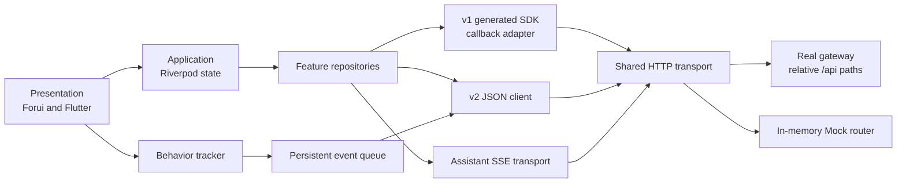

# Flutter 内容社区客户端设计

## 状态与范围

本页把当前架构中仍成立的取舍和跨仓契约要求整理为过渡设计。其上游意图和规格已于 2026-08-13
获得人类批准；本设计自身仍为 `baseline`，可用于理解、审查和登记偏离，但尚未被接受为
`accepted` 设计。

设计覆盖应用壳、路由、feature 分层、v1/v2/流式接口适配、Mock、行为反馈和验证边界；不决定后端
服务拓扑、排序算法或模型实现。

## 系统边界

真实入口与 Mock 入口在 transport 之前汇合，因此 feature 不出现 `isMockMode` 分支。实现事实与该设计
不一致时，在实现层登记，而不是给图补例外。默认请求 URI 是相对路径（如 `/api/v1/health`），由页面
源做反代或同源转发；仅在显式提供 `SERVER_HOST` 时才拼绝对地址。

## 组件职责

| 组件 | 职责 | 不应承担 |
| --- | --- | --- |
| `lib/features/*/presentation/` | 渲染状态、收集输入、导航、可见性测量 | 解析 HTTP、保存 token、决定服务端权限 |
| `lib/features/*/application/` | Riverpod 状态机、并发代次、重试命令 | 直接拼接 URL 或依赖 Widget context |
| `lib/features/*/data/` | 业务请求、响应校验、数据模型适配 | 页面样式和跨 feature 全局状态 |
| `lib/core/api/` | SDK callback/Future、v2 JSON、错误与鉴权适配 | feature 特有 UI 语义 |
| `lib/core/router/` | 路由表、公开/受保护边界、响应式导航壳 | 业务数据加载 |
| `lib/core/theme/`、`core/widgets/` | 主题与可复用视觉能力 | 复制 feature 状态机 |
| `lib/mock/` | 在共享 transport 后模拟接口契约和种子状态 | 创建另一套页面或 repository |
| `lib/sdk/` | 应用使用的生成 SDK 副本 | 手写应用 workaround |

## 路由与访问设计

公开读取路由包括 `/feed`、`/search`、`/post/:postId` 和 `/user/:userId`；登录与注册也公开。发布、
编辑、消息、Assistant、个人中心和资料编辑属于认证能力。关注流保留在公开 `/feed` 页面内，但认证状态
决定是否发起请求，匿名时显示登录引导。

`GoRouter.redirect` 负责硬边界，页面内入口负责解释性引导，两者共享同一个 Riverpod 认证状态。
`AuthNotifier` 恢复 token 和 userId，并通过 `refreshListenable` 通知路由重新判断。API 层只对明确的认证
业务码触发统一清理。

## 接口适配设计

共享 HTTP transport 通过 `apiUri` 解析路径。默认 `SERVER_HOST` 为空，请求保持 `/api/v1/...`、
`/api/v2/...` 相对路径；原生端或跨源调试可注入绝对 `SERVER_HOST`。

### v1 社区核心

生成 SDK 的 callback API 通过 `apiCall<T>` 转为 Future；文件上传使用 repository 调用 multipart
adapter。生成来源与应用副本保持清晰，契约新增 revision 或幂等字段时先改后端定义、运行
`tools/sync_gateway_sdk.py` 重新生成来源并补齐 PUT/DELETE，再同步副本和 repository，
不能只手改 `lib/sdk/`。goctl Dart 生成器仍只发出 GET/POST，动词修补属于同步脚本的固定步骤。

### v2 发现、消息与行为

`V2ApiClient` 统一 query 编码、Bearer header 和响应解包。各 repository 负责严格校验本 feature 的
必需字段：

- 推荐流保存字符串游标和完整归因上下文；关注流保存 `(createdAt, postId)` 游标。
- 搜索模型保留结果类型及降级元数据，页面将部分降级与零结果分开。
- 私信发送命令在 application 层生成幂等键；同一失败命令重试复用原对象。
- 行为批次只包含客户端拥有的动作，权威互动由服务端业务事务和 outbox 归因。

### Assistant 流

Assistant 使用独立 SSE transport，因为它需要逐事件消费并支持取消。repository 校验 HTTP、SSE 帧和
唯一终止事件；notifier 以 generation 丢弃旧订阅事件，累积 token、去重来源并保留降级/错误状态。
来源模型只接受规格允许的帖子证据字段；页面重新打开来源时仍走普通帖子权限。

## 关键数据流

### 推荐与反馈

1. Feed repository 创建或续用 `requestId`，获取带位置和来源的 `FeedEntry`。
2. notifier 在首次加载、刷新和加载更多之间保留正确游标，按帖子 ID 去重，并用 generation 抑制陈旧响应。
3. `PostCard` 只在活跃 tab 中测量可见性；达到 50% 且持续 1 秒后提交一次曝光，离开可见区后记录停留。
4. 点击直接记录 click。点赞等权威互动只调用互动接口；成功后的分析事件由服务端产生，客户端不重复提交。
5. 客户端事件进入按身份/会话分组的持久队列，服务端逐项确认后才删除，网络恢复后有界重试。

### 内容写入

1. 页面先进行长度、数量和类型校验，并保留本地编辑状态。
2. 新图片并行上传；任一失败则终止整次发布，不调用帖子写接口。
3. 创建命令携带幂等键；编辑/状态转换/删除携带最后读取的 revision。
4. 冲突或结果不确定时保留输入，明确提示刷新/重试，不能自动生成新命令造成重复写入。

### 资料帖子与收藏

个人资料的帖子列表与收藏列表共用 `userPostsProvider(UserPostsKey)`。任一列表在成为当前
tab、或从其它路由返回且仍为当前 tab 时，都重新请求第一页。请求代次丢弃陈旧的首屏响应，避免
会话内旧缓存挡住刚发布或刚收藏的帖子。

### 私信与 Assistant

- 私信线程先加载并独立标记已读；发送失败保存原命令，用户重试复用幂等键。列表、线程和导航未读数通过
  明确刷新收敛。文本上限 1000；图片先上传再带 `mediaId` 发送，并把 URL 写入 `content`。视频/语音
  仅在 `content` 为 URL 时展示，当前网关无对应上传接口，发送入口保持不可用。
- Assistant 每次只允许一个活跃流；取消先增加 generation 再关闭订阅。断流保留部分文本但不标记完成，
  source、done、error 都携带并更新会话上下文。

## UI 系统

`MaterialApp.router` 保留 Flutter 应用壳，builder 一次性注入 `FTheme`、`FToaster` 和
`FTooltipGroup`。`AppTheme` 同时维护 Material 与 Forui 的亮暗主题，并按平台选择 touch 或 desktop
variant。

主壳在 Forui `lg` 断点切换底部导航和桌面侧栏；正文由 `ContentConstraint` 限宽。`lg` 及以上
Feed 使用双列卡片、私信使用左列表右线程，Feed/私信内容宽放宽到 1100。移动端底栏仍为 5 项，
Assistant 从「我的」和消息页进入。主 Tab 页不再嵌套第二层 `FScaffold`。新增 feature 页面
优先使用 Forui/`FLucideIcons`，无法等价时才使用 Material，不为局部需求创建第二套主题或 overlay 根。

## 失败与恢复

| 失败 | 设计行为 |
| --- | --- |
| 首次读取失败 | 展示 ErrorView 和显式重试，不伪装空态 |
| 加载更多失败 | 保留已加载项目，允许再次加载 |
| 新请求先返回 | generation/cancel 使旧结果失效 |
| 乐观互动失败 | 回滚计数与状态，展示业务错误 |
| token 明确认定失效 | 清理会话并让路由重新判断 |
| 行为上报失败/离线 | 保留持久队列并退避；不阻塞主要交互 |
| Assistant 断流 | 保留部分文本，标记降级/错误，不伪造 done |
| 帖子写入冲突/未知 | 保留编辑内容，不静默覆盖或生成新权威写入 |

## 规格追踪

| 规格条款 | 设计区域 |
| --- | --- |
| `FX-001`～`FX-010` | 路由与访问、认证恢复、错误适配 |
| `FX-020`～`FX-022` | Feed/Search repository、游标、状态机和降级显示 |
| `FX-030`～`FX-032` | v1 生成契约、multipart、写入幂等与 revision |
| `FX-040`～`FX-041` | Message command、线程状态和未读收敛 |
| `FX-050`～`FX-051` | SSE transport、Assistant notifier、证据来源模型 |
| `FX-060`～`FX-062` | 可见性测量、事件所有权、持久队列 |
| `FX-070` | 共享 transport 与 Mock router |
| `FQ-001`～`FQ-008` | 分层、适配、UI 系统、异步状态、测试和知识治理 |

具体代码位置、当前偏离和验证结果分别见
[实现映射](../implementation/IMP-flutter-client.md)与
[基线证据](../evidence/EVD-client-baseline-2026-08-13.md)。
